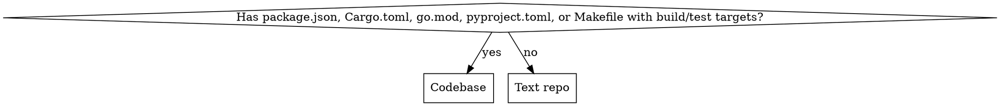
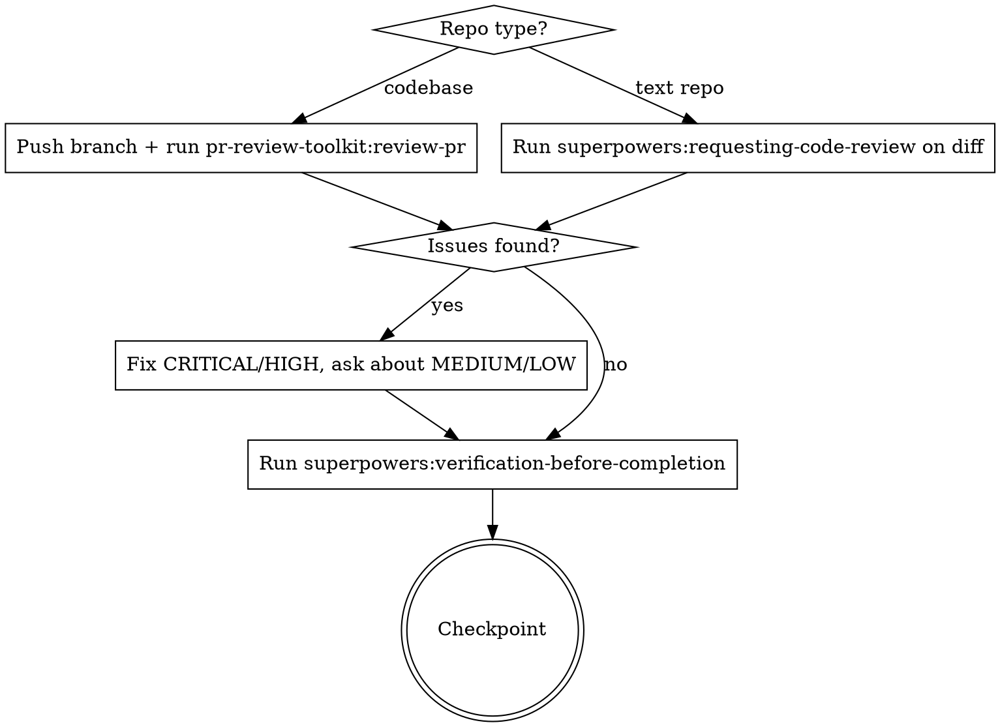
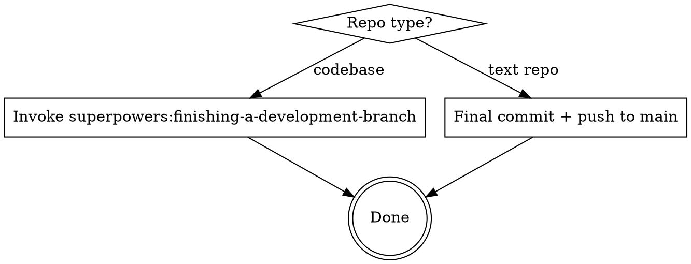

# Orchestrate: Full AI-Dev Workflow Automation

Automate a 5-phase development workflow with human approval checkpoints at every stage.

---

## What This Does

The `/orchestrate` command takes a feature request and runs it through structured phases — brainstorming, planning, building, reviewing, and shipping — pausing for your approval between each. It uses the superpowers and pr-review-toolkit plugins to handle each phase.

It works for both **codebases** (apps with tests, builds, branches) and **text repos** (markdown, config, documentation).

---

## Prerequisites

- These plugins installed:
  - superpowers (brainstorming, TDD, plans, verification)
  - pr-review-toolkit (code review)
  - commit-commands (git workflow)
- Git repository initialized

---

## Repo Type Detection

Before starting, determine the repo type. This affects branching and git workflow throughout.



**Codebase:** Has build tools, test runners, compiled output. Needs feature branches, PRs, test gates.

**Text repo:** Markdown, config, prompts, docs. Commits to main, no PR needed unless requested.

Store the result — every later phase checks it.

---

## Standards Discovery

Look for project standards in this order (use the first found):

1. `CONSTITUTION.md` in repo root
2. `CLAUDE.md` in repo root
3. `AGENTS.md` in repo root
4. Infer from existing code patterns and tooling

Reference whichever is found as "project standards" throughout.

---

## Phase 0: Explore

Invoke the `superpowers:brainstorming` skill to explore the idea with the user.

- Clarify requirements and constraints
- Propose 2-3 approaches with trade-offs
- Get user approval on the approach before proceeding

Ask user: "Does this capture what you want to build? Approve to continue to planning?"

---

## Phase 1: Plan

Invoke the `superpowers:writing-plans` skill to create an implementation plan.

- Read project standards for tech stack and coding conventions
- Create a detailed plan at `docs/plans/YYYY-MM-DD-[feature]-plan.md`
- Break into bite-sized tasks with exact file paths, code, and test commands

Ask user: "Review the plan. Approve to start building?"

---

## Phase 1.5: Branch Setup (codebases only)

**Skip this phase entirely for text repos.**

After plan approval, before any code changes:

1. Invoke `superpowers:using-git-worktrees` to create an isolated feature branch
2. Branch name: `feat/[feature-slug]` (derived from the plan title)
3. Confirm worktree is ready before proceeding to build

This ensures all implementation happens on a feature branch, not main.

---

## Phase 2: Build

**Always use `superpowers:subagent-driven-development`.** Do not ask which execution mode to use — subagent-driven is the default. Only fall back to `superpowers:executing-plans` if subagents are unavailable on the platform.

- Implement task-by-task following the plan
- **Codebases:** Write tests before implementation (TDD), commit after each completed task
- **Text repos:** Commit logical chunks as you go
- Follow project standards throughout

Ask user: "Implementation complete. Ready for review?"

---

## Phase 3: Review



**Codebases:**
1. Push the feature branch to remote
2. Invoke `pr-review-toolkit:review-pr` — fires six specialized reviewers (silent failure hunter, type design analyzer, PR test analyzer, code reviewer, code simplifier, comment analyzer)
3. Fix critical/high issues, ask user about medium/low
4. Run `superpowers:verification-before-completion` to verify all tests pass

**Text repos:**
1. Invoke `superpowers:requesting-code-review` on the diff since orchestration started
2. Fix any issues found
3. Run `superpowers:verification-before-completion`

Ask user: "Review complete. Approve to write documentation?"

---

## Phase 4: Document

Use the Technical Writer agent (`technical-writer`) to create or update documentation:

- Update README.md with feature documentation
- Add usage examples and code samples
- Document API endpoints if applicable
- Add troubleshooting for common issues

**After docs are written, commit them** (to feature branch for codebases, to main for text repos).

Then run `/wrap` to capture session learnings and produce a summary.

Ask user: "Documentation complete. Ready to ship?"

---

## Ship



**Codebases:** Invoke `superpowers:finishing-a-development-branch` which presents options:
- Create a PR (default for team repos)
- Merge locally
- Keep branch as-is
- Discard

**Text repos:** Ensure all changes are committed and push to main.

---

## User Interaction Points

You pause for approval at these checkpoints:

1. After brainstorming: "Does this capture what you want?"
2. After planning: "Review the plan. Ready to build?"
3. After building: "Implementation complete. Ready for review?"
4. After review: "Review complete. Approve documentation?"
5. After documentation: "Ready to ship?"

Between checkpoints, work autonomously. Only pause for approval, not micro-decisions.

---

## Usage

```
/orchestrate "Build user authentication with email and OAuth"
```

---

## Example Run (Codebase)

```
You: /orchestrate "Add a comments system to blog posts"

Claude (Phase 0 — Explore):
  Using superpowers:brainstorming...
  Explored requirements, proposed 3 approaches
  → Does this capture what you want? [y/n]

You: y — go with threaded comments

Claude (Phase 1 — Plan):
  Using superpowers:writing-plans...
  Created plan at docs/plans/2026-04-01-comments-plan.md (12 tasks)
  → Review the plan. Ready to build? [y/n]

You: y

Claude (Phase 1.5 — Branch):
  Detected codebase (package.json found)
  Using superpowers:using-git-worktrees...
  Created branch feat/threaded-comments in worktree

Claude (Phase 2 — Build):
  Using superpowers:subagent-driven-development...
  Task 1/12: Comment model + migration (tests passing) [committed]
  ...
  Task 12/12: Notification preferences (tests passing) [committed]
  → Implementation complete. Ready for review? [y/n]

You: y

Claude (Phase 3 — Review):
  Pushed feat/threaded-comments to origin
  Using pr-review-toolkit:review-pr...
  6 specialized reviewers completed
  Found: 1 MEDIUM issue (missing rate limiting)
  → Fix now? [y/n]

You: y
  Fixed + verified: all tests passing

Claude (Phase 4 — Document):
  Updated README, added API examples [committed]
  Session learnings captured via /wrap
  → Ready to ship? [y/n]

You: y

Claude (Ship):
  Using superpowers:finishing-a-development-branch...
  → Created PR #47: "feat: add threaded comments system"
```

---

## Key Principles

1. **Autonomous between checkpoints** — Human approval at phase transitions, not micro-decisions
2. **Repo-type aware** — Codebases get branches + PRs; text repos commit to main
3. **Plugin-powered** — Each phase delegates to the best available plugin/skill
4. **Quality gates** — Review phase runs specialized checks, verification proves claims
5. **Learning capture** — Every session improves future orchestration via /wrap
