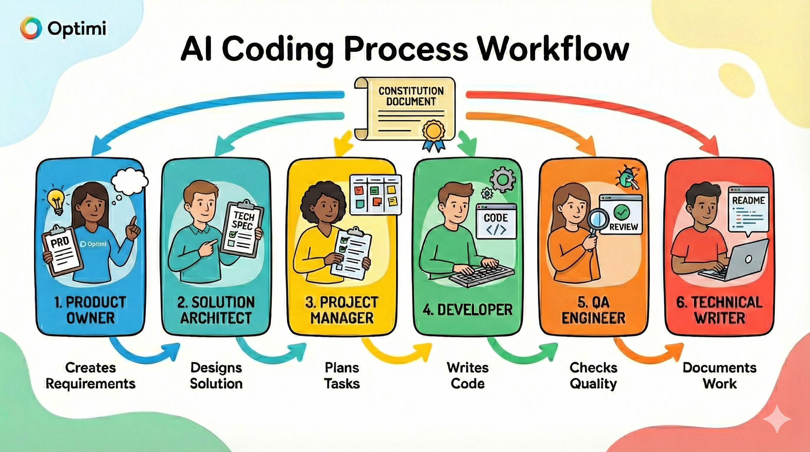

# AI-Dev-Orchestrator

A framework for building software with AI that actually works — structured personas, copy-paste prompts, and (if you use Claude Code) a fully automated workflow.

> Built by a non-coder pushing the limits of what's possible without a human developer at the wheel. Collaboration welcome. — MCS

---

## Get Started in 2 Minutes

### Using Claude Code? (Recommended)

```bash
# 1. Clone this repo somewhere on your machine
git clone https://github.com/Optiminz/ai-dev-orchestrator.git ~/ai-dev-orchestrator

# 2. Run the setup script in your project
~/ai-dev-orchestrator/setup.sh /path/to/your-project

# 3. Open your project in Claude Code
# Claude auto-detects the setup, scans your codebase, and configures itself
```

That's it. Claude configures `CONSTITUTION.md` for your tech stack, loads 6 development agents, and you can start building immediately with `/orchestrate`.

### Using Cursor, ChatGPT, Replit, or another AI?

1. Copy `CONSTITUTION-TEMPLATE.md` to your project as `CONSTITUTION.md`
2. Customize the tech stack section for your project
3. Use prompts from `prompts/` — start with `prompts/phase-1-planning/1.1-product-owner-prd.md`

---

## What a Finished Run Looks Like

Here's what running `/orchestrate "Build user authentication"` produces:

```
Claude (Phase 1 — Planning):
  ✓ Invoking Product Owner persona
  ✓ Creating PRD at docs/user-auth-prd.md
  → Review PRD. Approve to continue? [y/n]

You: y

Claude (Phase 1 — Design):
  ✓ Invoking Solutions Architect persona
  ✓ Creating Tech Spec at docs/user-auth-tech-spec.md
  ✓ Tech stack validated against CONSTITUTION.md
  → Review Tech Spec. Approve to generate tasks? [y/n]

You: y

Claude (Phase 2 — Implementation):
  ✓ Generating task list (18 tasks)
  ✓ Implementing task by task...
  ✓ Tests passing after each task
  ✓ All 18 tasks committed

Claude (Phase 3 — Review):
  ✓ QA Engineer review complete
  Issues: MEDIUM: Missing rate limiting on login endpoint
  → Fix issues now? [y/n]

You: y

Claude (Phase 4 — Documentation):
  ✓ README.md updated with auth documentation
  ✓ Session learnings captured

  Feature: user-authentication
  Tasks: 18/18 ✓  Coverage: 87%  Constitution: ✓

  Ready to merge.
```

**You control every checkpoint. AI does the work between them.**

---

## Two Ways to Use This

### Path A: Claude Code (Automated)

**Best for:** Anyone who can use Claude Code

- 6 specialized agents auto-loaded into every session
- `/orchestrate` runs the full 4-phase workflow with human approval at checkpoints
- Session learning system remembers decisions and patterns across sessions
- `setup.sh` bootstraps everything into your project in one command

**Get started:** Run `setup.sh` above, then open your project in Claude Code.

### Path B: Any AI Tool (Manual)

**Best for:** Cursor, ChatGPT, Replit, or any AI coding tool

- Copy `CONSTITUTION.md` to your project to keep AI on track
- Use 15 copy-paste prompts from `prompts/` in sequence
- Each persona prompt tells the AI exactly what role to play and what to produce

**Get started:** See [`quick-start/README.md`](./quick-start/README.md) for the minimal 3-prompt workflow.

---

## Full Setup for `/orchestrate`

The `/orchestrate` command needs three things installed in Claude Code to run fully automated:

### 1. Superpowers plugin
Adds structured brainstorming, TDD, parallel subagents, and verification guardrails at each phase gate.

**Install:** Search `superpowers` in the Claude Code plugin marketplace (or visit [claudeplugins.com](https://claudeplugins.com)).

### 2. Ralph Loop plugin
The engine that drives Phase 2. Ralph runs tasks iteratively in a loop with self-correction — without it, `/orchestrate` can't automate implementation.

**Install:** Search `ralph-loop` in the Claude Code plugin marketplace.

### 3. Stop hooks
Shell scripts that run after each Claude turn to enforce quality gates — checking the constitution is loaded, required artifacts exist, and tasks are marked complete before moving on. These live in `.claude/hooks/stop/` and are configured by `setup.sh`.

**Verify:** After running `setup.sh`, check `.claude/hooks/stop/` in your project.

---

| Layer | Role |
|-------|------|
| ai-dev-orchestrator | WHAT — phases, personas, constitution, artifact templates |
| Superpowers | HOW — discipline at brainstorm, TDD, verify, and review moments |
| Ralph Loop | ENGINE — iterative implementation with self-correction in Phase 2 |
| Stop hooks | GATES — enforce quality between every Claude turn |
| `/orchestrate` | GLUE — calls all of the above at the right moment |

> Without Superpowers or Ralph Loop, `/orchestrate` still runs — it skips the automated steps and prompts you to handle them manually instead.

---

## What's In This Repo

```
ai-dev-orchestrator/
├── setup.sh                           ← Start here: bootstraps into your project
├── CONSTITUTION-TEMPLATE.md           ← Copy to your project as CONSTITUTION.md
│
├── .claude/                           ← Claude Code integration (copied by setup.sh)
│   ├── agents/                        ← 6 auto-discovered development agents
│   │   ├── product-owner-prd.md
│   │   ├── solutions-architect.md
│   │   ├── specialist-developer.md
│   │   ├── qa-engineer.md
│   │   ├── technical-writer.md
│   │   └── frontend-design-orchestrator.md
│   ├── commands/                      ← /orchestrate and /reflect slash commands
│   └── learnings/                     ← Session learning system
│
├── personas/                          ← 5 AI persona definitions (source of agents)
├── prompts/                           ← 15 copy-paste prompts (manual workflow)
│   ├── phase-1-planning/              ← 4 prompts: PRD, Tech Spec, DB, API
│   ├── phase-2-implementation/        ← 3 prompts: Tasks, Implementation, Comments
│   ├── phase-3-review/                ← 6 prompts: QA, Bugs, Security, Style, Tests, Refactor
│   └── phase-4-documentation/         ← 2 prompts: README, User Guide
│
├── templates/                         ← Constitution templates by project type
│   ├── internal-tool-constitution.md
│   ├── client-app-constitution.md
│   ├── ai-agent-constitution.md
│   └── claude-project-setup/          ← Template for .claude/ directory structure
│
├── examples/                          ← Example constitutions + sample outputs
├── guides/                            ← Tool-specific setup (Claude Code, Cursor, Replit)
├── quick-start/                       ← Minimal manual workflow (3 prompts)
└── workflow/                          ← Phase checklists and prompt selection guide
```

---

## The 5 AI Personas

Each persona is a specialist. When you invoke them (via agent in Claude Code, or by copy-pasting the prompt from `personas/`), they stay in character and produce their specific artifact.

| Persona | What they do | Output |
|---------|-------------|--------|
| **Product Owner** | Defines what and why | PRD with user stories and acceptance criteria |
| **Solutions Architect** | Defines how | Tech spec, DB schema, API design |
| **Specialist Developer** | Implements | Code, task by task |
| **QA Engineer** | Reviews | Bugs, security issues, edge cases |
| **Technical Writer** | Documents | README, user guides |

See [`personas/README.md`](./personas/README.md) for full persona definitions.

---

## The 4-Phase Workflow

```
┌────────────────────────────────────────────────────────────┐
│  Phase 1: PLANNING                                          │
│  Product Owner → PRD  →  Architect → Tech Spec             │
└────────────────────────────────────────────────────────────┘
                            ↓
┌────────────────────────────────────────────────────────────┐
│  Phase 2: IMPLEMENTATION                                    │
│  Generate Task List → Implement task by task               │
└────────────────────────────────────────────────────────────┘
                            ↓
┌────────────────────────────────────────────────────────────┐
│  Phase 3: REVIEW                                           │
│  QA Review → Fix Issues → (Optional) Refactor              │
└────────────────────────────────────────────────────────────┘
                            ↓
┌────────────────────────────────────────────────────────────┐
│  Phase 4: DOCUMENTATION                                    │
│  README → User Guides → Session Reflection                 │
└────────────────────────────────────────────────────────────┘
```

**Minimum viable flow** (Quick Start):
1. `1.1-product-owner-prd.md` — define the feature
2. `2.2-iterative-implementation.md` — build it
3. `3.1-qa-comprehensive-review.md` — check it

---

## How It All Connects



---

## Core Principles

**Constitution = The Rules**
Every AI persona follows `CONSTITUTION.md`. This keeps the tech stack, coding style, and quality bar consistent across every session and every persona.

**One Task at a Time**
✅ "Implement task #3: Create POST /api/auth/password-reset endpoint"
❌ "Build the entire password reset system"

**Human as Orchestrator**
You assign tasks to personas, review outputs, and make the final calls. AI provides expertise, you provide judgment.

**Plan Before Building**
PRD + Tech Spec before code. Catches misunderstandings before they become bugs.

---

## Constitution Templates

Not sure how to configure your project? Start with a template:

- [`templates/internal-tool-constitution.md`](./templates/internal-tool-constitution.md) — team tools (5–50 users, fast iteration)
- [`templates/client-app-constitution.md`](./templates/client-app-constitution.md) — customer-facing apps (security, polish)
- [`templates/ai-agent-constitution.md`](./templates/ai-agent-constitution.md) — bots and API services (reliability, integrations)

**Examples with sample outputs:**
- [Internal tool example](./examples/internal-tool/CONSTITUTION.md) — expense tracker
- [Client app example](./examples/client-app/CONSTITUTION.md) — SaaS dashboard
- [AI agent example](./examples/ai-agent/CONSTITUTION.md) — Slack bot
- [Sample PRD](./examples/sample-outputs/sample-prd.md)
- [Sample Tech Spec](./examples/sample-outputs/sample-tech-spec.md)

---

## Tool-Specific Setup

- **[Claude Code](./guides/claude-code-setup.md)** — CLI-based, full automation available
- **[Cursor IDE](./guides/cursor-setup.md)** — Visual, recommended for beginners
- **[Replit AI](./guides/replit-setup.md)** — Browser-based, instant deployment

---

## Frequently Asked Questions

**Do I need all 15 prompts?**
No. Minimum viable: PRD → Implementation → QA Review.

**Which AI should I use?**
Any capable model works: Claude (Sonnet/Opus), GPT-4, Gemini. Claude Code unlocks the automated path.

**Does this work for existing projects?**
Yes. Run `setup.sh` in your existing project. Claude will scan the codebase and configure `CONSTITUTION.md` based on what it finds.

**Isn't this overkill for small features?**
For trivial changes (change button text), yes. For anything that requires design decisions, it saves time by catching issues before they become bugs.

---

## Why This Works

This framework is based on research combining:
- **AI Dev Tasks** methodology (task-based prompting)
- **Persona-based AI programming** (specialized roles)
- **Constitutional AI** principles
- **OWASP** security standards

See [`docs/research-origin.md`](./docs/research-origin.md) for full citations.

The session learning system was inspired by [Developers Digest](https://www.youtube.com/watch?v=-4nUCaMNBR8).

---

## Contributing

Found a better prompt? Improved a persona? Built an interesting example? Open an issue or PR.

---

## Credits

**Created by:** Malcolm (with Gemini Deep Research + Claude)

---

## License

MIT — use freely, attribution appreciated.
